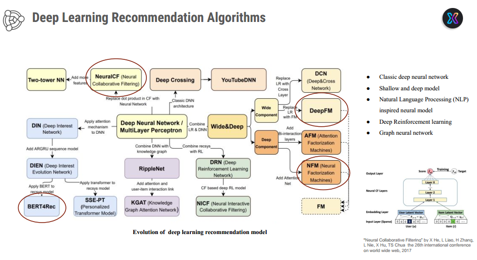

# Defito-Ashadel-Ghaisani_231011402454

## Dataset
- Download [Books.zip](Books.zip) dan ekstrak menggunakan password: `12345`.

# Book Recommendation System

## Alur Sistem Rekomendasi
### 1. Klasifikasi Model Deep Learning
  
*Taksonomi algoritma deep learning untuk rekomendasi (Sumber: He et al., WWW 2017)*

### 2. Taksonomi Sistem Rekomendasi
  
*Kategori sistem rekomendasi: Non-personalized, Content-Based, Collaborative Filtering*

## Dataset
- `Books.csv`: Metadata buku (judul, penulis, ISBN)
- `Ratings.csv`: Riwayat rating pengguna
- `Users.csv`: Profil pengguna
